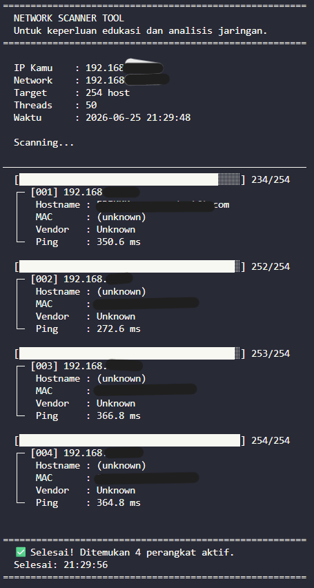
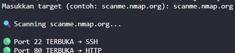
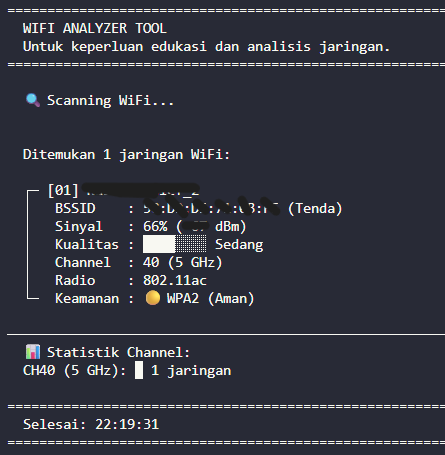
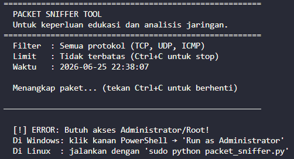

# Network Reconnaissance & Analysis Tools

A collection of Python-based networking tools designed for educational purposes, network analysis, and cybersecurity learning.

This repository demonstrates practical implementations of network discovery, port scanning, wireless network analysis, and packet inspection techniques.

---

## ⚠️ Disclaimer

This project is intended for:

- Educational use
- Cybersecurity learning
- Network administration training
- Authorized security assessments

Do not use these tools on networks or systems without proper authorization.

---

## Features

### Network Scanner

- Discover active hosts on a local network
- Retrieve IP addresses
- Display MAC addresses
- Device identification

### Port Scanner Pro

- Scan TCP ports
- Detect open services
- Multi-port analysis
- Service enumeration

### WiFi Analyzer

- Analyze nearby wireless networks
- Display SSID information
- Signal strength monitoring
- Channel utilization analysis

### Packet Sniffer

- Capture network packets
- Inspect traffic information
- Analyze protocols
- Educational packet monitoring

---

## Screenshots

### Network Scanner



Scans local networks and discovers active devices.

---

### Port Scanner Pro



Detects open ports and running services.

---

### WiFi Analyzer



Displays wireless network information and signal statistics.

---

### Packet Sniffer



Captures and analyzes network packets for educational purposes.

---

## Project Structure

```text
Network-Recon-Tools/
│
├── screenshots/
│   ├── network_scanner.png
│   ├── port_scanner.png
│   ├── wifi_analyzer.png
│   └── packet_sniffer.png
│
├── network_scanner.py
├── port_scanner_pro.py
├── wifi_analyzer.py
├── packet_sniffer.py
│
├── README.md
├── requirements.txt
├── LICENSE
└── .gitignore
```

---

## Installation

Clone repository:

```bash
git clone https://github.com/erikadiameka/Network-Recon-Tools.git
cd Network-Recon-Tools
```

Install dependencies:

```bash
pip install -r requirements.txt
```

---

## Usage

### Network Scanner

```bash
python network_scanner.py
```

### Port Scanner Pro

```bash
python port_scanner_pro.py
```

### WiFi Analyzer

```bash
python wifi_analyzer.py
```

### Packet Sniffer

```bash
python packet_sniffer.py
```

---

## Requirements

- Python 3.10+
- Scapy
- Colorama
- Netifaces
- Requests

Install:

```bash
pip install -r requirements.txt
```

---

## License

Licensed under the MIT License.

---

## Author

Erik Adia Meka

- GitHub: https://github.com/erikadiameka
- LinkedIn: https://linkedin.com/in/erikadiameka
